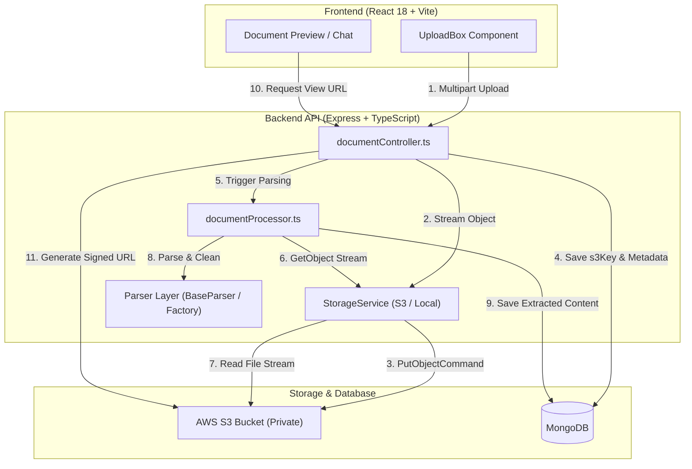

# AWS S3 Cloud Storage Implementation Plan: AI-Document-QA-Platform

## 1. Executive Summary & Objectives

This implementation plan details the architectural transition of **AI-Document-QA-Platform** (DevDocs AI) from local disk storage (`backend/uploads/`) to **Amazon Simple Storage Service (AWS S3)**.

Migrating to AWS S3 provides:
1. **Stateless Backend Architecture**: Decouples physical file storage from the Node.js server, allowing horizontal scaling across containerized clusters (Docker, AWS ECS, Kubernetes, Render, Railway).
2. **Infinite Elasticity & Durability**: Provides 99.999999999% (11 9's) data durability with virtually limitless storage capacity.
3. **Tenant-Isolated S3 Key Hierarchy**: Enforces multi-tenant data partitioning in object keys (`users/{userId}/documents/{timestamp}-{filename}`).
4. **Secure Document Previews**: Generates short-lived, cryptographically signed Presigned URLs for viewing/downloading files without making the S3 bucket public.
5. **Zero-Downtime Local Fallback**: Implements a unified Storage Abstraction (`IStorageService`) allowing automatic fallback to local disk when AWS credentials are not configured in local development.

---

## 2. Architectural Approaches Comparison

```
┌────────────────────────────────────────────────────────────────────────┐
│                      Upload Architecture Options                       │
├──────────────────────────┬─────────────────────────────────────────────┤
│ Option A: Server-Mediated│ Client ──> Express API (Multer) ──> AWS S3  │
│ Streaming Upload         │ • Zero frontend changes required            │
│ (Recommended for Phase 1)│ • Centralized file validation & processing  │
│                          │ • Immediate parsing pipeline trigger        │
├──────────────────────────┼─────────────────────────────────────────────┤
│ Option B: Direct-to-S3   │ Client ──> Gets Presigned URL ──> AWS S3    │
│ Presigned URLs           │ • Offloads bandwidth from API server        │
│ (Optional for Phase 2)   │ • Requires two-step upload handshake        │
└──────────────────────────┴─────────────────────────────────────────────┘
```

### Recommendation: **Option A with S3 Storage Service (Phase 1)**
* **Why**: The existing frontend [`UploadBox.tsx`](file:///home/pandey/Desktop/Folders/AI-Projects/AI-Document-QA-Platform/frontend/src/components/UploadBox.tsx) and backend [`upload.ts`](file:///home/pandey/Desktop/Folders/AI-Projects/AI-Document-QA-Platform/backend/src/middleware/upload.ts) already handle multipart streams with full extension and MIME validation.
* **How it works**: Multer receives the file into memory or a temporary buffer, streams it to AWS S3 using `@aws-sdk/lib-storage`, triggers the `documentProcessor`, and returns document metadata to the client.

---

## 3. System Architecture & S3 Key Structure



### S3 Object Key Hierarchy
Files will be organized hierarchically by user ID to guarantee strict data segregation:

```text
s3://devdocs-ai-storage/
  └── users/
      └── {userId}/
          └── documents/
              └── {timestamp}-{randomId}.{ext}
```
* **Example**: `users/66f28a7b9d/documents/1727258384912-384729182.pdf`

---

## 4. AWS Infrastructure & IAM Configuration

### 4.1 S3 Bucket Settings
* **Bucket Name**: e.g., `devdocs-ai-storage`
* **Region**: e.g., `us-east-1` (or your closest region)
* **Block Public Access**: **ENABLED** (All 4 checkboxes checked). The bucket must remain completely private.
* **Default Encryption**: **SSE-S3 (AES-256)** enabled.
* **Bucket Versioning**: Enabled (recommended for disaster recovery).

### 4.2 S3 Bucket CORS Configuration
Allows the frontend to securely access presigned URLs:

```json
[
  {
    "AllowedHeaders": ["*"],
    "AllowedMethods": ["GET", "PUT", "HEAD"],
    "AllowedOrigins": ["http://localhost:5173", "https://yourproductiondomain.com"],
    "ExposeHeaders": ["ETag"],
    "MaxAgeSeconds": 3600
  }
]
```

### 4.3 IAM Policy (Least-Privilege)
Create an IAM User (e.g. `devdocs-backend-user`) with programmatic access and attach this policy:

```json
{
  "Version": "2012-10-17",
  "Statement": [
    {
      "Sid": "DevDocsS3ObjectAccess",
      "Effect": "Allow",
      "Action": [
        "s3:PutObject",
        "s3:GetObject",
        "s3:DeleteObject"
      ],
      "Resource": "arn:aws:s3:::devdocs-ai-storage/users/*"
    },
    {
      "Sid": "DevDocsS3BucketAccess",
      "Effect": "Allow",
      "Action": [
        "s3:ListBucket"
      ],
      "Resource": "arn:aws:s3:::devdocs-ai-storage"
    }
  ]
}
```

---

## 5. Technical Implementation Details

### 5.1 Dependencies to Install
We will use the modern, modular **AWS SDK v3**:

```bash
cd backend
npm install @aws-sdk/client-s3 @aws-sdk/s3-request-presigner @aws-sdk/lib-storage
```

---

### 5.2 Storage Service Abstraction (`src/services/storage/`)

#### `IStorageService.ts`
```typescript
import { Readable } from "stream";

export interface UploadResult {
  key: string;               // S3 object key or relative local path
  url?: string;              // Public or presigned URL
  storageType: "s3" | "local";
}

export interface IStorageService {
  readonly storageType: "s3" | "local";

  /**
   * Uploads a file buffer or stream to storage.
   */
  uploadFile(
    fileBuffer: Buffer,
    fileName: string,
    mimeType: string,
    userId: string
  ): Promise<UploadResult>;

  /**
   * Retrieves a readable stream of the stored file.
   */
  getFileStream(key: string): Promise<Readable>;

  /**
   * Downloads the file to a temporary local path for file-path based parsers.
   */
  downloadToTempFile(key: string): Promise<string>;

  /**
   * Generates a time-limited presigned URL for viewing/downloading.
   */
  getSignedDownloadUrl(key: string, expiresInSeconds?: number): Promise<string>;

  /**
   * Deletes a file from storage.
   */
  deleteFile(key: string): Promise<void>;
}
```

#### `S3StorageService.ts`
```typescript
import {
  S3Client,
  PutObjectCommand,
  GetObjectCommand,
  DeleteObjectCommand,
} from "@aws-sdk/client-s3";
import { getSignedUrl } from "@aws-sdk/s3-request-presigner";
import { Upload } from "@aws-sdk/lib-storage";
import { Readable } from "stream";
import fs from "fs/promises";
import path from "path";
import os from "os";
import { IStorageService, UploadResult } from "./IStorageService.js";

export class S3StorageService implements IStorageService {
  readonly storageType = "s3";
  private s3: S3Client;
  private bucket: string;

  constructor() {
    const region = process.env.AWS_REGION || "us-east-1";
    const accessKeyId = process.env.AWS_ACCESS_KEY_ID;
    const secretAccessKey = process.env.AWS_SECRET_ACCESS_KEY;
    const bucket = process.env.AWS_S3_BUCKET;

    if (!accessKeyId || !secretAccessKey || !bucket) {
      throw new Error("AWS S3 environment variables (KEY, SECRET, BUCKET) are not fully configured");
    }

    this.bucket = bucket;
    this.s3 = new S3Client({
      region,
      credentials: {
        accessKeyId,
        secretAccessKey,
      },
    });
  }

  public async uploadFile(
    fileBuffer: Buffer,
    fileName: string,
    mimeType: string,
    userId: string
  ): Promise<UploadResult> {
    const uniqueSuffix = `${Date.now()}-${Math.round(Math.random() * 1e9)}`;
    const ext = path.extname(fileName).toLowerCase();
    const key = `users/${userId}/documents/${uniqueSuffix}${ext}`;

    const parallelUpload = new Upload({
      client: this.s3,
      params: {
        Bucket: this.bucket,
        Key: key,
        Body: fileBuffer,
        ContentType: mimeType,
        Metadata: {
          originalName: fileName,
          uploadedBy: userId,
        },
      },
    });

    await parallelUpload.done();

    return {
      key,
      storageType: "s3",
    };
  }

  public async getFileStream(key: string): Promise<Readable> {
    const command = new GetObjectCommand({
      Bucket: this.bucket,
      Key: key,
    });
    const response = await this.s3.send(command);
    return response.Body as Readable;
  }

  public async downloadToTempFile(key: string): Promise<string> {
    const stream = await this.getFileStream(key);
    const tempDir = os.tmpdir();
    const tempPath = path.join(tempDir, `s3-${Date.now()}-${path.basename(key)}`);

    const chunks: Buffer[] = [];
    for await (const chunk of stream) {
      chunks.push(typeof chunk === "string" ? Buffer.from(chunk) : chunk);
    }
    await fs.writeFile(tempPath, Buffer.concat(chunks));
    return tempPath;
  }

  public async getSignedDownloadUrl(key: string, expiresInSeconds = 3600): Promise<string> {
    const command = new GetObjectCommand({
      Bucket: this.bucket,
      Key: key,
    });
    return getSignedUrl(this.s3, command, { expiresIn: expiresInSeconds });
  }

  public async deleteFile(key: string): Promise<void> {
    const command = new DeleteObjectCommand({
      Bucket: this.bucket,
      Key: key,
    });
    await this.s3.send(command);
  }
}
```

#### `StorageFactory.ts` (Graceful Fallback Resolver)
```typescript
import { IStorageService } from "./IStorageService.js";
import { S3StorageService } from "./S3StorageService.js";
import { LocalStorageService } from "./LocalStorageService.js";

export class StorageFactory {
  private static instance: IStorageService;

  public static getStorage(): IStorageService {
    if (!this.instance) {
      const hasAwsConfig =
        !!process.env.AWS_ACCESS_KEY_ID &&
        !!process.env.AWS_SECRET_ACCESS_KEY &&
        !!process.env.AWS_S3_BUCKET;

      if (hasAwsConfig) {
        console.log("☁️ Initialized AWS S3 Cloud Storage.");
        this.instance = new S3StorageService();
      } else {
        console.warn("📁 AWS S3 credentials not found. Defaulting to Local Disk Storage (uploads/).");
        this.instance = new LocalStorageService();
      }
    }

    return this.instance;
  }
}
```

---

### 5.3 Database Schema Updates (`models/Document.ts`)

Add S3-specific metadata to the `IDocument` interface:

```typescript
export interface IDocument extends MongooseDocument {
  title: string;
  originalFileName: string;
  storagePath: string;                // S3 Object Key or local path
  storageType: "s3" | "local";        // Storage provider identifier
  s3Bucket?: string;                  // S3 Bucket name
  s3Region?: string;                  // S3 Region
  mimeType: string;
  sizeBytes: number;
  uploadedBy: Types.ObjectId;
  status: DocumentStatus;
  failureReason?: string | null;
  pageCount?: number;
  extractedStats?: {
    totalUnits?: number;
    totalCharacters?: number;
    detectedFormat?: string;
  };
  extractedContent?: IParsedItem[];
  createdAt: Date;
  updatedAt: Date;
}
```

---

### 5.4 Document Controller & Parser Integration

#### In `documentController.ts`:
1. **Upload**: Multer uses `multer.memoryStorage()` (or saves to temp disk).
   ```typescript
   const storageService = StorageFactory.getStorage();
   const { key, storageType } = await storageService.uploadFile(
     req.file.buffer,
     req.file.originalname,
     req.file.mimetype,
     uploadedBy
   );

   const doc = await Document.create({
     title: req.body.title || req.file.originalname,
     originalFileName: req.file.originalname,
     storagePath: key,
     storageType,
     mimeType: req.file.mimetype,
     sizeBytes: req.file.size,
     uploadedBy,
     status: "uploaded",
   });

   processDocument(doc._id, key, req.file.mimetype);
   ```

2. **Secure Preview / Download (`GET /api/documents/:id/download-url`)**:
   ```typescript
   export async function getDocumentDownloadUrl(req: Request, res: Response): Promise<Response> {
     const doc = await Document.findOne({ _id: req.params.id, uploadedBy: req.user!.id });
     if (!doc) return res.status(404).json({ error: "Document not found" });

     const storageService = StorageFactory.getStorage();
     const url = await storageService.getSignedDownloadUrl(doc.storagePath);
     return res.json({ downloadUrl: url });
   }
   ```

3. **Delete (`DELETE /api/documents/:id`)**:
   ```typescript
   const storageService = StorageFactory.getStorage();
   await storageService.deleteFile(doc.storagePath);
   await Document.findByIdAndDelete(req.params.id);
   ```

#### In `documentProcessor.ts`:
* If `storageType === "s3"`, call `storageService.downloadToTempFile(key)` to get a local path for `PDFLoader` / `mammoth` / `xlsx`, parse the content, and delete the temporary file after extraction completes!

---

## 6. Step-by-Step Implementation Roadmap

```
Phase 1: AWS Dependencies & Environment Configuration
                        │
Phase 2: Storage Service Layer (IStorageService, S3StorageService, LocalStorageService)
                        │
Phase 3: Document Model & Multer Memory Storage Configuration
                        │
Phase 4: Document Controller Integration (Upload, Delete, Signed URL)
                        │
Phase 5: Document Processor Handshake & Temp File Cleanup
                        │
Phase 6: Verification & End-to-End Testing with Live S3 Bucket
```

### Phase 1: Dependencies & Config (Priority: High)
1. Install `@aws-sdk/client-s3`, `@aws-sdk/s3-request-presigner`, `@aws-sdk/lib-storage` in `backend/`.
2. Update `backend/.env.example` and `backend/.env` with AWS variables:
   ```env
   AWS_REGION=us-east-1
   AWS_ACCESS_KEY_ID=your_access_key
   AWS_SECRET_ACCESS_KEY=your_secret_key
   AWS_S3_BUCKET=devdocs-ai-storage
   ```

### Phase 2: Storage Services (Priority: High)
1. Create `backend/src/services/storage/IStorageService.ts`.
2. Implement `backend/src/services/storage/S3StorageService.ts` using AWS SDK v3.
3. Implement `backend/src/services/storage/LocalStorageService.ts` for offline/fallback mode.
4. Create `backend/src/services/storage/StorageFactory.ts` with auto-detection.

### Phase 3: Schema & Upload Middleware (Priority: High)
1. Add `storageType: "s3" | "local"` to [`Document.ts`](file:///home/pandey/Desktop/Folders/AI-Projects/AI-Document-QA-Platform/backend/src/models/Document.ts).
2. Configure Multer to support memory buffer processing.

### Phase 4: Controller & Endpoints (Priority: High)
1. Update `uploadDocument` in [`documentController.ts`](file:///home/pandey/Desktop/Folders/AI-Projects/AI-Document-QA-Platform/backend/src/controllers/documentController.ts) to upload via `StorageFactory`.
2. Update `deleteDocument` to remove S3 objects via `storageService.deleteFile()`.
3. Add `GET /api/documents/:id/download-url` to generate secure presigned viewing links.

### Phase 5: Parser Layer Handshake (Priority: High)
1. Update [`documentProcessor.ts`](file:///home/pandey/Desktop/Folders/AI-Projects/AI-Document-QA-Platform/backend/src/services/documentProcessor.ts) to resolve files from S3 or local disk.
2. Clean up temporary scratch files after parsing completes.

### Phase 6: Verification & Testing (Priority: High)
1. Verify with `npm run build` (`tsc`).
2. Test uploading a PDF and Excel file to S3.
3. Confirm S3 console displays objects under `users/{userId}/documents/`.
4. Verify document status transitions to `"ready"` in MongoDB.
