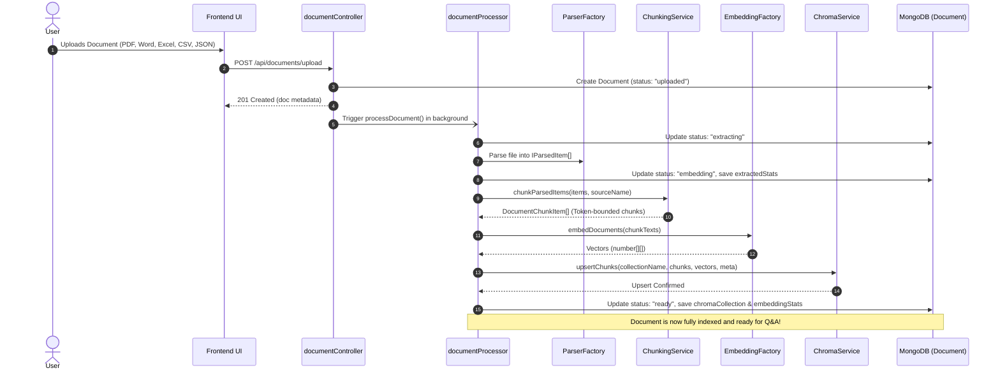
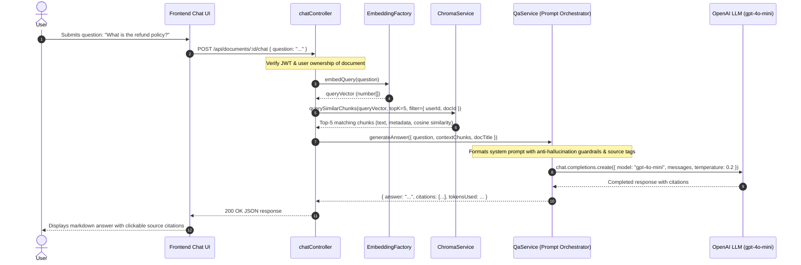

# ChromaDB Vector Database & OpenAI RAG Q&A Implementation Plan

## 1. Executive Summary & Architecture Overview

This implementation plan details the architecture and step-by-step roadmap for **Stage 5** of the **DevDocs AI** platform: integrating **ChromaDB** as the high-performance vector database to store and retrieve document embeddings generated by OpenAI (`text-embedding-3-small` / `large`) and Hugging Face (`all-MiniLM-L6-v2`), and orchestrating prompt-grounded conversational Q&A with OpenAI LLMs (`gpt-4o-mini` / `gpt-4o`).

```
┌─────────────────────────────────────────────────────────────────────────────────────────────────┐
│                                   END-TO-END RAG ARCHITECTURE                                   │
│                                                                                                 │
│   INGESTION & STORAGE PIPELINE (WRITE PATH)                                                     │
│   [File Upload] ──> [ParserFactory] ──> [ChunkingService] ──> [EmbeddingFactory]                │
│                            │                                         │                          │
│                            ▼                                         ▼                          │
│                     (Parsed Units)                           (Vector Floats)                    │
│                                                                      │                          │
│                                                                      ▼                          │
│                                                      ┌───────────────────────────────┐          │
│                                                      │      ChromaDB Collection      │          │
│                                                      │  (IDs, Vectors, Metadata, Doc)│          │
│                                                      └───────────────┬───────────────┘          │
│                                                                      │                          │
│   RETRIEVAL & Q&A PIPELINE (READ PATH)                               │ (Similarity Search)      │
│   [User Question] ──> [embedQuery()] ────────────────────────────────┘                          │
│                                                                      │                          │
│                                                                      ▼                          │
│                                                             (Top-K Chunks + Dist)               │
│                                                                      │                          │
│                                                                      ▼                          │
│                                                        ┌───────────────────────────┐            │
│                                                        │   Grounded Context Prompt │            │
│                                                        └─────────────┬─────────────┘            │
│                                                                      │                          │
│                                                                      ▼                          │
│                                                        ┌───────────────────────────┐            │
│                                                        │     OpenAI Chat Model     │            │
│                                                        │   (gpt-4o-mini / gpt-4o)  │            │
│                                                        └─────────────┬─────────────┘            │
│                                                                      │                          │
│                                                                      ▼                          │
│                                                        [Final Answer with Citations]            │
└─────────────────────────────────────────────────────────────────────────────────────────────────┘
```

---

## 2. End-to-End System Flows

### 2.1 Ingestion & Embedding Storage Flow (Write Path)



---

### 2.2 Semantic Retrieval & Q&A Flow (Read Path)



---

## 3. ChromaDB Architecture & Technical Specifications

### 3.1 Client & Connection Topology
- **Driver**: `chromadb` npm package (TypeScript client).
- **Deployment Topology**:
  - **Local Development**: Dockerized ChromaDB container running on `http://localhost:8000`:
    ```bash
    docker run -d -p 8000:8000 -v ./chroma_data:/chroma/chroma chromadb/chroma:latest
    ```
  - **Cloud / Production**: Chroma Cloud or self-hosted ECS / Kubernetes instance.
- **Client Configuration**:
  ```typescript
  import { ChromaClient } from "chromadb";

  const chromaClient = new ChromaClient({
    path: process.env.CHROMA_URL || "http://localhost:8000",
    auth: process.env.CHROMA_AUTH_TOKEN
      ? { provider: "token", credentials: process.env.CHROMA_AUTH_TOKEN }
      : undefined,
  });
  ```

---

### 3.2 Dual-Embedding Collection Strategy

ChromaDB enforces a strict invariant: **Every vector inside a collection must have the exact same dimension.**
Because our platform supports both OpenAI (`text-embedding-3-small` with 1536 or 512 dimensions) and Hugging Face (`all-MiniLM-L6-v2` with 384 dimensions), collections are partitioned deterministically by embedding provider and dimensionality:

| Model | Dimensions | Chroma Collection Name | Distance Metric (`hnsw:space`) |
| :--- | :---: | :--- | :---: |
| **OpenAI `text-embedding-3-small`** | 1,536 | `devdocs_openai_1536` | `"cosine"` |
| **OpenAI `text-embedding-3-small` (MRL)** | 512 | `devdocs_openai_512` | `"cosine"` |
| **OpenAI `text-embedding-3-large`** | 3,072 | `devdocs_openai_3072` | `"cosine"` |
| **Hugging Face `all-MiniLM-L6-v2` (Local)** | 384 | `devdocs_huggingface_384` | `"cosine"` |

```typescript
export function getCollectionNameForModel(modelName: string, dimensions: number): string {
  const sanitizedModel = modelName.replace(/[^a-zA-Z0-9]/g, "_").toLowerCase();
  return `devdocs_${sanitizedModel}_${dimensions}`;
}
```

---

### 3.3 ChromaDB Schema & Metadata Storage

When chunk vectors are upserted into ChromaDB:

```typescript
collection.upsert({
  ids: string[],          // Format: `${docId}_chunk_${chunkIndex}`
  embeddings: number[][], // Raw vector coordinates
  metadatas: Record<string, string | number | boolean>[],
  documents: string[],    // The raw chunk text content
});
```

#### Metadata Fields:
| Field | Type | Description |
| :--- | :--- | :--- |
| `userId` | `string` | **Mandatory**: ID of the owning user for strict multi-tenant isolation |
| `documentId` | `string` | **Mandatory**: MongoDB ObjectId of the parent document |
| `source` | `string` | Original file name (e.g. `financial_report.pdf`) |
| `chunkIndex` | `number` | Sequential 0-indexed position within the document |
| `pageNumber` | `number` | Page number for PDFs and Word docs (omitted for non-paginated files) |
| `sheetName` | `string` | Excel sheet name for spreadsheets |
| `rowNumber` | `number` | Spreadsheet or CSV row number |
| `format` | `string` | `"pdf"` \| `"tabular"` \| `"docx"` \| `"json"` \| `"prose"` |
| `charCount` | `number` | Character length of the chunk content |

---

### 3.4 Multi-Tenant Metadata Filtering

To ensure a user can never access or retrieve vectors belonging to another tenant:

```typescript
// Query scoped to a single specific document
const singleDocFilter = {
  $and: [
    { userId: { $eq: userId } },
    { documentId: { $eq: documentId } }
  ]
};

// Cross-document query across all documents owned by user
const userWideFilter = {
  userId: { $eq: userId }
};
```

---

## 4. Prompt Engineering & OpenAI Q&A Engine (`QaService`)

### 4.1 System Prompt Design

To guarantee factual accuracy and completely prevent hallucinations, the system prompt enforces strict grounding:

```typescript
export const RAG_SYSTEM_PROMPT = `You are DevDocs AI, an expert technical documentation assistant.
Your job is to answer user questions with extreme factual accuracy using ONLY the information provided in the Context below.

### STRICT INSTRUCTIONS:
1. ONLY use facts directly stated in the Context. Do NOT use outside knowledge, speculate, or extrapolate.
2. If the Context does not contain the answer, reply EXACTLY with:
   "I could not find information about this in the provided documents."
3. Every factual statement must cite its source using inline citation tags in the format [Source X], where X corresponds to the Source number in the context.
4. If multiple sources support a statement, combine citations like [Source 1, Source 3].
5. Format code blocks with proper syntax highlighting (\`\`\`language ... \`\`\`).
6. Present tabular or structured data as clean Markdown tables.
7. Be direct, professional, and concise.`;
```

---

### 4.2 Context Formatting Template

Retrieved top-$k$ chunks from ChromaDB are formatted with clear source tags before insertion into the user prompt:

```typescript
export function buildContextString(chunks: RetrievedChunk[]): string {
  return chunks
    .map((chunk, index) => {
      const sourceNum = index + 1;
      let location = "";
      if (chunk.metadata.pageNumber) {
        location = ` | Page ${chunk.metadata.pageNumber}`;
      } else if (chunk.metadata.sheetName) {
        location = ` | Sheet: ${chunk.metadata.sheetName}, Row: ${chunk.metadata.rowNumber}`;
      }

      return `--- [Source ${sourceNum} | File: ${chunk.metadata.source}${location}] ---\n${chunk.content}`;
    })
    .join("\n\n");
}
```

---

### 4.3 LLM Execution & Cost Management
- **Primary Model**: `gpt-4o-mini` (fast, lowest latency, cost-efficient: $0.15 / 1M input tokens).
- **Enterprise High-Precision Model**: `gpt-4o` (configurable via `OPENAI_CHAT_MODEL`).
- **Sampling Temperature**: `0.2` (low temperature ensures deterministic, non-hallucinatory output).
- **Token Limits**: `max_tokens: 1500`.

---

## 5. Directory Structure & File Additions

```
backend/
├── src/
│   ├── config/
│   │   ├── chroma.ts                     # ChromaDB client initialization & health check
│   │   └── db.ts
│   ├── controllers/
│   │   ├── chatController.ts             # NEW: Q&A query handler (single & multi-doc)
│   │   ├── documentController.ts         # UPDATED: Added Chroma cleanup on doc deletion
│   │   └── authController.ts
│   ├── models/
│   │   ├── Document.ts                   # UPDATED: Added chromaCollection field & "ready" status
│   │   └── User.ts
│   ├── routes/
│   │   ├── chatRoutes.ts                 # NEW: /api/chat & /api/documents/:id/chat
│   │   └── documentRoutes.ts
│   ├── services/
│   │   ├── vectorDb/                     # NEW: Vector Database Abstraction
│   │   │   ├── IVectorDbService.ts       # Generic vector DB interface
│   │   │   ├── ChromaService.ts          # ChromaDB client implementation
│   │   │   └── index.ts
│   │   ├── qa/                           # NEW: Q&A & Prompt Orchestration
│   │   │   ├── QaService.ts              # OpenAI prompt builder & LLM caller
│   │   │   ├── promptTemplates.ts        # Grounded system & context prompt templates
│   │   │   └── index.ts
│   │   ├── documentProcessor.ts          # UPDATED: Stores vectors in ChromaDB & sets "ready"
│   │   ├── chunking/
│   │   └── embeddings/
│   ├── scripts/
│   │   ├── test-embeddings.ts
│   │   └── test-chroma-rag.ts            # NEW: End-to-end verification script for ChromaDB + RAG
│   └── server.ts                         # UPDATED: Mount chat routes
├── .env.example                          # UPDATED: Added CHROMA_URL & OPENAI_CHAT_MODEL
└── package.json                          # UPDATED: Added chromadb dependency
```

---

## 6. Implementation Specifications & Code Contracts

### 6.1 `IVectorDbService.ts`
```typescript
export interface VectorChunkRecord {
  id: string;
  vector: number[];
  content: string;
  metadata: {
    userId: string;
    documentId: string;
    source: string;
    chunkIndex: number;
    pageNumber?: number;
    sheetName?: string;
    rowNumber?: number;
    format?: string;
    charCount: number;
    [key: string]: any;
  };
}

export interface VectorQueryOptions {
  queryVector: number[];
  topK?: number;
  userId: string;
  documentId?: string;
  minSimilarity?: number;
}

export interface RetrievedChunk {
  id: string;
  content: string;
  distance: number;
  similarityScore: number;
  metadata: Record<string, any>;
}

export interface IVectorDbService {
  name: string;
  initialize(): Promise<void>;
  upsertChunks(collectionName: string, records: VectorChunkRecord[]): Promise<void>;
  querySimilar(collectionName: string, options: VectorQueryOptions): Promise<RetrievedChunk[]>;
  deleteByDocumentId(collectionName: string, documentId: string): Promise<void>;
}
```

---

### 6.2 `ChromaService.ts`
```typescript
import { ChromaClient, Collection } from "chromadb";
import { IVectorDbService, VectorChunkRecord, VectorQueryOptions, RetrievedChunk } from "./IVectorDbService.js";

export class ChromaService implements IVectorDbService {
  public readonly name = "ChromaDB";
  private client: ChromaClient;
  private collectionsCache = new Map<string, Collection>();

  constructor(chromaUrl = process.env.CHROMA_URL || "http://localhost:8000") {
    this.client = new ChromaClient({ path: chromaUrl });
  }

  public async initialize(): Promise<void> {
    const version = await this.client.version();
    console.log(`⚡ ChromaService connected to ChromaDB v${version}`);
  }

  public async getOrCreateCollection(name: string): Promise<Collection> {
    if (this.collectionsCache.has(name)) {
      return this.collectionsCache.get(name)!;
    }

    const collection = await this.client.getOrCreateCollection({
      name,
      metadata: { "hnsw:space": "cosine" },
    });
    this.collectionsCache.set(name, collection);
    return collection;
  }

  public async upsertChunks(collectionName: string, records: VectorChunkRecord[]): Promise<void> {
    if (records.length === 0) return;
    const collection = await this.getOrCreateCollection(collectionName);

    // Batch upserts in chunks of 200 to prevent payload overflow
    const BATCH_SIZE = 200;
    for (let i = 0; i < records.length; i += BATCH_SIZE) {
      const batch = records.slice(i, i + BATCH_SIZE);
      await collection.upsert({
        ids: batch.map((r) => r.id),
        embeddings: batch.map((r) => r.vector),
        documents: batch.map((r) => r.content),
        metadatas: batch.map((r) => r.metadata),
      });
    }
  }

  public async querySimilar(collectionName: string, options: VectorQueryOptions): Promise<RetrievedChunk[]> {
    const collection = await this.getOrCreateCollection(collectionName);
    const topK = options.topK || 5;

    // Construct tenant-isolated filter
    const whereClause: Record<string, any> = options.documentId
      ? { $and: [{ userId: { $eq: options.userId } }, { documentId: { $eq: options.documentId } }] }
      : { userId: { $eq: options.userId } };

    const results = await collection.query({
      queryEmbeddings: [options.queryVector],
      nResults: topK,
      where: whereClause,
    });

    const retrieved: RetrievedChunk[] = [];
    const ids = results.ids[0] || [];
    const docs = results.documents[0] || [];
    const metas = results.metadatas[0] || [];
    const distances = results.distances?.[0] || [];

    for (let i = 0; i < ids.length; i++) {
      const distance = distances[i] ?? 1.0;
      // Cosine distance to similarity: similarity = 1 - distance
      const similarityScore = Math.max(0, 1 - distance);

      if (options.minSimilarity && similarityScore < options.minSimilarity) {
        continue;
      }

      retrieved.push({
        id: ids[i],
        content: docs[i] || "",
        distance,
        similarityScore,
        metadata: (metas[i] as Record<string, any>) || {},
      });
    }

    return retrieved;
  }

  public async deleteByDocumentId(collectionName: string, documentId: string): Promise<void> {
    try {
      const collection = await this.getOrCreateCollection(collectionName);
      await collection.delete({
        where: { documentId: { $eq: documentId } },
      });
    } catch (err: any) {
      console.warn(`ChromaService: deleteByDocumentId warning: ${err.message}`);
    }
  }
}
```

---

### 6.3 `QaService.ts`
```typescript
import { ChatOpenAI } from "@langchain/openai";
import { SystemMessage, HumanMessage } from "@langchain/core/messages";
import { RetrievedChunk } from "../vectorDb/IVectorDbService.js";
import { RAG_SYSTEM_PROMPT, buildContextString } from "./promptTemplates.js";

export interface QaResult {
  answer: string;
  citations: Array<{
    sourceIndex: number;
    fileName: string;
    pageNumber?: number;
    sheetName?: string;
    rowNumber?: number;
    similarityScore: number;
    snippet: string;
  }>;
  tokenUsage?: {
    promptTokens: number;
    completionTokens: number;
    totalTokens: number;
  };
}

export class QaService {
  private llm: ChatOpenAI;

  constructor(modelName = process.env.OPENAI_CHAT_MODEL || "gpt-4o-mini") {
    this.llm = new ChatOpenAI({
      model: modelName,
      temperature: 0.2,
      apiKey: process.env.OPENAI_API_KEY,
    });
  }

  public async answerQuestion(
    question: string,
    chunks: RetrievedChunk[],
    documentTitle?: string
  ): Promise<QaResult> {
    if (chunks.length === 0) {
      return {
        answer: "I could not find any relevant information in the uploaded documents to answer your question.",
        citations: [],
      };
    }

    const contextText = buildContextString(chunks);
    const userPrompt = `Context:\n${contextText}\n\nQuestion: ${question}\n\nHelpful Answer (with citations):`;

    const response = await this.llm.invoke([
      new SystemMessage(RAG_SYSTEM_PROMPT),
      new HumanMessage(userPrompt),
    ]);

    const citations = chunks.map((chunk, idx) => ({
      sourceIndex: idx + 1,
      fileName: chunk.metadata.source || documentTitle || "Document",
      pageNumber: chunk.metadata.pageNumber,
      sheetName: chunk.metadata.sheetName,
      rowNumber: chunk.metadata.rowNumber,
      similarityScore: parseFloat((chunk.similarityScore * 100).toFixed(1)),
      snippet: chunk.content.slice(0, 150) + "...",
    }));

    return {
      answer: response.content as string,
      citations,
      tokenUsage: (response as any).response_metadata?.tokenUsage,
    };
  }
}
```

---

### 6.4 Updates to `documentProcessor.ts`

```diff
     // 7. Vector Embedding Generation
     const embeddingService = EmbeddingFactory.getEmbeddingService();
     const textsToEmbed = chunks.map((c) => c.content);
     const vectors = await embeddingService.embedDocuments(textsToEmbed);

+    // 8. ChromaDB Vector Database Storage (Stage 5 Scope)
+    const collectionName = getCollectionNameForModel(
+      embeddingService.modelName,
+      embeddingService.dimensions
+    );
+    const chromaService = new ChromaService();
+    const records: VectorChunkRecord[] = chunks.map((chunk, i) => ({
+      id: `${docId}_chunk_${chunk.chunkIndex}`,
+      vector: vectors[i],
+      content: chunk.content,
+      metadata: {
+        userId: doc.uploadedBy.toString(),
+        documentId: docId.toString(),
+        source: doc.originalFileName,
+        chunkIndex: chunk.chunkIndex,
+        ...chunk.metadata,
+      },
+    }));
+    await chromaService.upsertChunks(collectionName, records);
+
-    // Status retained as "embedding"
-    await Document.findByIdAndUpdate(docId, { embeddingStats: ... });
+    // 9. Finalize Document Status to "ready"
+    await Document.findByIdAndUpdate(docId, {
+      status: "ready",
+      chromaCollection: collectionName,
+      embeddingStats: {
+        model: embeddingService.modelName,
+        dimensions: embeddingService.dimensions,
+        totalChunks: chunks.length,
+        embeddedAt: new Date(),
+      },
+      failureReason: null,
+    });
```

---

## 7. Step-by-Step Implementation Roadmap

| Phase | Tasks & Deliverables | Verification Milestone |
| :--- | :--- | :--- |
| **Phase 1: ChromaDB Environment & Dependencies** | 1. Add `chromadb` to `backend/package.json`<br>2. Update `.env.example` with `CHROMA_URL` and `OPENAI_CHAT_MODEL`<br>3. Provide Docker compose command for local ChromaDB instance | `npm install` passes; ChromaDB connectivity confirmed |
| **Phase 2: Vector DB Service Layer** | 1. Implement `IVectorDbService.ts`<br>2. Implement `ChromaService.ts` with auto-collection partitioning and batch upserts<br>3. Implement tenant-isolated similarity query with cosine distance | Unit test verifying collection creation and query |
| **Phase 3: DocumentProcessor Pipeline Finalization** | 1. Update `Document.ts` schema (`chromaCollection: string`, status `"ready"`)<br>2. Wire `ChromaService.upsertChunks` into `documentProcessor.ts`<br>3. Transition document status to `"ready"` upon successful upsert<br>4. Add cascading Chroma vector deletion on document removal in `documentController.ts` | Upload document $\rightarrow$ Status automatically transitions from `uploaded` $\rightarrow$ `extracting` $\rightarrow$ `embedding` $\rightarrow$ `ready` |
| **Phase 4: Prompt Engineering & Q&A Service** | 1. Implement `promptTemplates.ts` with strict anti-hallucination rules and citation format<br>2. Implement `QaService.ts` using `@langchain/openai`<br>3. Implement `chatController.ts` and `chatRoutes.ts` (`POST /api/documents/:id/chat`) | API returns grounded answer with structured citation cards |
| **Phase 5: Automated Verification Test Suite** | 1. Create `backend/src/scripts/test-chroma-rag.ts`<br>2. Verify ingestion $\rightarrow$ chunking $\rightarrow$ ChromaDB storage $\rightarrow$ query similarity $\rightarrow$ OpenAI prompt generation | Complete script runs and outputs citation table |
| **Phase 6: Frontend Integration** | 1. Enable "Chat" button on [`DocumentCard.tsx`](file:///home/pandey/Desktop/Folders/AI-Projects/AI-Document-QA-Platform/frontend/src/components/DocumentCard.tsx) for `"ready"` documents<br>2. Create interactive QA modal/drawer in frontend<br>3. Render markdown responses and clickable source citation badges | User clicks "Chat", asks questions, and views answers with citations |
